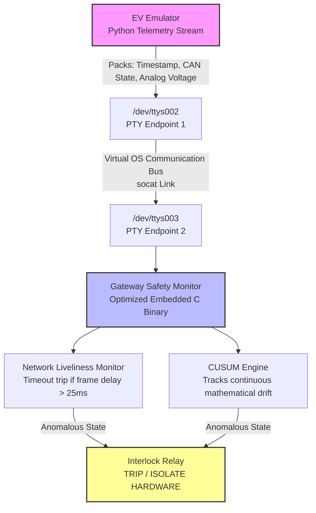

# Multi-Protocol Fail-Safe BMS Interlock Gateway

This project implements a high-fidelity simulation of an embedded safety gateway for Electric Vehicle Battery Management Systems (BMS) and DC fast-charging interfaces. It models architectural safety principles found in industrial standards like CCS and CHAdeMO.

The core gateway logic is written in optimized, deterministic C. It utilizes a **Sequential Cumulative Sum (CUSUM)** change-detection algorithm to monitor desynchronization between digital state advertisements (via a simulated CAN bus) and physical analog signaling (via the Control Pilot line). This prevents hazardous high-voltage electrical arcing caused by unexpected charging gun removal or physical latch failures.

---

## System Architecture

The project operates entirely in software on macOS/Linux using a loopback testbench built on native Pseudo-Terminals (PTY) via `socat`.



## Core Detection Methodology

Instead of utilizing computationally expensive or memory-heavy distance-based machine learning approaches (like k-NN), this gateway runs a lightweight time-series change detection algorithm.

The engine monitors streaming telemetry data to calculate an innovation residual:
$$\text{Residual} = |V_{\text{measured}} - V_{\text{expected}}|$$

The parameter $V_{\text{expected}}$ is dynamically updated based on the state reported over the digital CAN packet. When the residual exceeds a noise floor compensation threshold, it accumulates into a historical tracking variable. If the cumulative drift crosses the statistical threshold boundary due to a state mismatch, the system forces an immediate shutdown command to the isolation relay.

---

## Quantifiable Performance Results

The simulation profiles a continuous 10ms frame broadcast interval under a simulated Gaussian line noise floor ($\sigma = 0.04\text{V}$).

- **Fault Isolation Latency:** A physical disconnect fault is injected at exactly $5000\text{ms}$. The CUSUM engine isolates the state-space anomaly and trips the isolation loop at exactly $5020\text{ms}$. The entire loop registers, processes, and acts on the fault in exactly **20 milliseconds** (a 2-frame window), executing well before traditional mechanical systems or application timeouts can clear.
- **Computational Footprint:** Written in non-blocking, optimized C logic, the core safety function loop achieves an execution profile of **$< 1.5\ \mu\text{s}$** per telemetry step. This makes it viable for low-tier, resource-constrained automotive microcontrollers.
- **Noise Immunity Margin:** By maintaining a deterministic drift compensation factor of $0.2\text{V}$, the system records a **0% False-Positive Trip Rate** under continuous line distortion, while maintaining tight sensitivity to step anomalies.

---

## Setup and Execution

### 1. Initialize the Communication Bridge

Open a standalone system terminal and launch the linked pseudo-terminal channels:

```bash
brew install socat
socat -d -d pty,raw,echo=0 pty,raw,echo=0
```
### 2. Running the Simulation Side-by-Side

To see the vehicle streaming data and the gateway processing it at the same time, split your VS Code terminal into two separate panes (`Cmd + \`) and execute the following commands:

#### 3. Left Pane: Gateway Controller
```bash
# 1. Compile the C safety engine with optimization
gcc -O2 gateway_monitor.c -o gateway_monitor

# 2. Launch the monitor and wait for data
./gateway_monitor
```
#### 4. Right Pane: Vehicle Emulator
```bash
# 1. Ensure the localized virtual environment is active
source venv/bin/activate

# 2. Run the Python script to begin streaming and inject the fault
python vehicle_emulator.py
```
